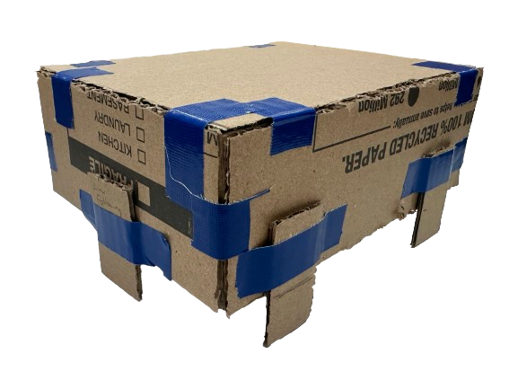

# CardBoard Prototype

The prototype primarily focuses on the robot's body as seen in Figure 1. Its purpose is to establish overall measurements for seamless integration into 3D modeling. A specific objective we aim to gauge is the optimal angle for the scooper/arm to rest on the body, enabling it to reach Ken while also elevating to reach the dinosaurs. Another objective we hope to ascertain is the overall size of the body, ensuring adequate space for all components, and determine the placement of the ultrasonic sensor and line following sensor.

  
   
  <strong>Figure 1:</strong> Cardboard Prototype (so far).

# Reflection on Our Cardboard Prototype

## What did we set out to do?
- Determine the placement of the line sensor
- Determine maximum length and width of the robot base and wheels
- Decide on the location and size of the arm and scoop
- Determine the location of the DC motors powering the wheels. 
- Location of the ultrasonic sensors

## What did we learn from the prototype?
**Line Sensor**
- The line sensor cannot be positioned in the middle of the front of the robot base because it will collide with the ramp on the way up or down.

**Base and Wheels**
- Since the arena door measures 25 cm, the robot's width must be smaller than that to ensure easy passage without a snug fit. The maximum length is limited to 22 cm to fit within the 23 cm space between the ramp and Ken's placement hole.

**Arm and Scoop**
- Placing the arm base at the front of the robot ensures ample space for electronic components at the rear. The scoop, located at the front, can exceed the robot's width as it has the capability to be lifted higher than the arena door.

**DC Motors**
- The DC motors are quite lengthy and occupy a significant amount of space on the top of the robot base.

**Ultrasonic Sensors**
- An ultrasonic sensor cannot be positioned at the front of the robot because the scoop and arm will obstruct its placement.

## What changes did we make based on our the insights?

**Line Sensor**
- Positioning the line sensor at the rear of the robot is crucial. Placing it at the back ensures that it won't encounter obstacles, such as the ramp, during ascents or descents. This strategic placement allows the robot to consistently sense the line throughout the entire line-following procedure.

**Base and Wheels**
- The robot's width of 17 cm was chosen to accommodate the 25 cm arena door. The length of the base was chosen to be 20 cm to ensure optimal space for movement on the ramp.

**Arm and Scoop**
- The arm and scoop will be wider than the robot and raised when the robot is entering the arena door. The arm base will be secured to the front part of the robot base.

**DC Motors**
- The DC motors will be placed on the bottom of the base to allow for more room for Raspberry Pi, breadboard, and other electronic components.

**Ultrasonic Sensors**
- The three ultrasonic sensors will be placed with two at each side and one at the back.