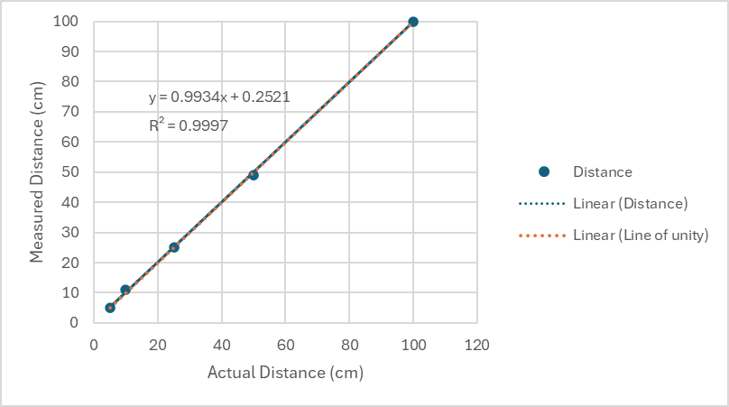

The ultrasonic sensor performs well within the teams tested distances of 5-100 cm relative to its stated sensing range of 2 cm to 400 cm. This is quantified by the value of R2 in Table 1 (the linear regression model fits the data almost perfectly) and portrayed visualy when comparing the distance line to the line of unity in Figure 1.

**Table 1:** Table of distance measurements.
| # | Actual Distance (cm) | Measured Distance (cm) | Slope | R2 |
|---|----------------------|------------------------|-------|---------------|
| 1 | 5                    | 5                      |0.9934 |0.9997         |
| 2 | 10                   | 11                     |       |               |
| 3 | 25                   | 25                     |       |               |
| 4 | 50                   | 49                     |       |               |
| 5 | 100                  | 100                    |       |               |

 
**Figure 1:** Plot of distance measurements.

**Reference:**
Fernando, J. (no date) R-squared: Definition, calculation formula, uses, and limitations, Investopedia. Available at: https://www.investopedia.com/terms/r/r-squared.asp#:~:text=To%20calculate%20the%20total%20variance,you%20have%20the%20R%2Dsquared. (Accessed: 07 February 2024). 