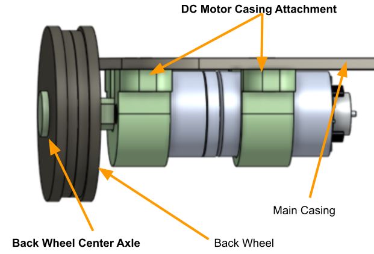
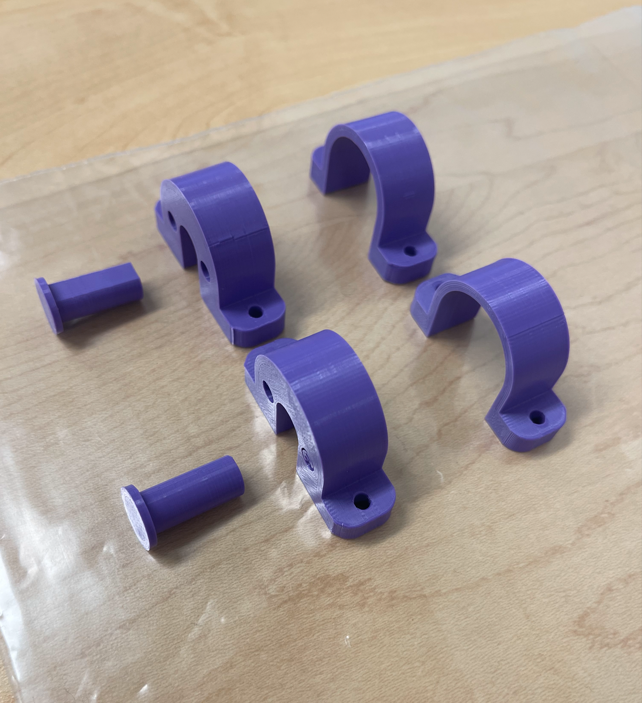

# Mechanical Module
## DC Motor and Back Wheel Attachment
The mechanical module chosen for display is the motor and wheel attachment to the main casing. The main casing and back wheel will be made out of carboard for display purposes until the laser cut parts can be obtained. 

 
**Figure 1:** DC Motor and Wheel attachment to the main casing.

 
**Figure 2:** DC Motor and Wheel 3D Printed Part.

